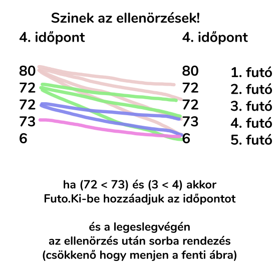

# Ati-futok

Küldök egy ábrát hogy miszerint kell szerintem ellenörizni, nekem igy kijöttek azok a **Futo.Ki-k** amik a lapon voltak

## Végső ellenőrzésnél

Emellett még ellenörzéskor ellenörizni is kell hogy a távolság 0 felett van e, de ha nem teszed az se nagy baj mert majdnem ugyan az lesz az eredmény csak mivel a 4. futó páratlannal kezdett igy bemegy -1-re és akkor beirja még a 41. időpontot is (akkor ér be)

## Miért multidimenziós tömb

`[ hol tart, mennyit megy, hányadik futó ]`

Ha van változás és azután sorba rendezem tudni fogja hogy az adott sorból mennyit kell levennie és hogy ő eredetileg hányadik futó mert ahogy mutattam fontos tudni hogy hányadikként indult mert akik távolról beelöztek egy közelebbit csak akkor kell kiirni az időpontot

## Végeredmény

| Időpontok  | Távolság | Ki elözőtt be kit | Szövegesen |
| --- | --- | --- | --- |
| Időpont:  4  | 72 < 73 | 2. futó  <  4 . futó | ( 2. futó beelőzte a 4. futót) |
| Időpont:  4  | 72 < 73 | 3. futó  <  4 . futó | ( 3. futó beelőzte a 4. futót) |
| Időpont:  5  | 66 < 68 | 2. futó   <  3. futó | ( 2. futó beelőzte a 3. futót) |
| Időpont:  7  | 65 < 67 | 1. futó  <  4. futó  | ( 1. futó beelőzte a 4. futót) |
| Időpont:  13 | 35 < 36 | 1. futó  <  3. futó  | ( 1. futó beelőzte a 3. futót) |
